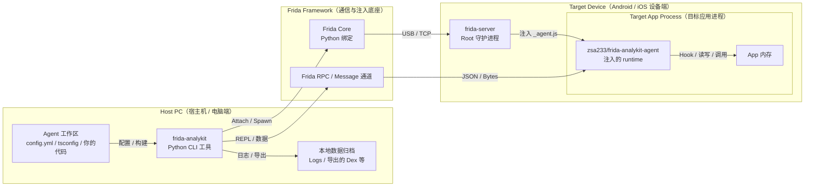

# Frida-Analykit

[](https://github.com/zsa233/frida-analykit/stargazers)
[](LICENSE)

🌍 语言: 中文 | [English](README_EN.md)

`frida-analykit` v2 是一个双产物 monorepo：Python CLI 负责环境、构建、注入和数据归档，npm runtime `@zsa233/frida-analykit-agent` 负责自定义 TypeScript Frida agent 的运行时能力。

## 项目定位

- Python CLI 负责 `frida-server` 生命周期、设备连接、工作区生成、构建、attach/spawn、REPL 和导出落盘。
- `frida-analykit-mcp` 可以把当前 Frida 调试链路暴露成 stdio MCP server。
- `@zsa233/frida-analykit-agent` 提供 helper、JNI、ELF、SSL、Dex 等可按需导入的 agent runtime 能力。
- 当前支持范围是 `frida>=16.5.9,<18`，当前受测版本是 `16.5.9` 和 `17.8.2`；实际环境是否可继续，以 `frida-analykit doctor` 的结论为准。

## 架构说明图



## 快速开始

1. 安装 CLI。完成后你会得到 `frida-analykit` 和 `frida-analykit-mcp` 两个命令。

```sh
uv tool install "git+https://github.com/ZSA233/frida-analykit@stable"
```

2. 创建并进入匹配版本的 Frida 虚拟环境。完成后你会得到一个固定版本的调试上下文。

```sh
frida-analykit env create --frida-version 17.8.2 --name frida-17.8.2
frida-analykit env shell frida-17.8.2
```

3. 确认 Android 设备已连上宿主机。完成后你应能在列表里看到目标设备。

```sh
adb devices
```

4. 生成 agent 工作区并安装依赖。完成后你会得到可直接修改的 `config.toml`、`index.ts`、`package.json`、`README.md` 和 `README_EN.md`。

```sh
frida-analykit gen dev --work-dir ./my-agent
cd ./my-agent
npm install
```

5. 先做环境检查。完成后你会直接知道当前 Frida、设备和远端 `frida-server` 是否已经可用。

```sh
frida-analykit doctor --config ./config.toml
```

6. 如果 `doctor` 仍提示远端安装或版本红项，先修复并启动远端链路。完成后设备侧会进入可注入状态。

```sh
frida-analykit doctor fix --config ./config.toml
frida-analykit server boot --config ./config.toml
```

7. 编译、注入并进入 REPL。完成后会生成 `_agent.js`、建立 session，并在终端看到 banner。

```sh
frida-analykit attach --config ./config.toml --build --repl
```

如果目标 app 还没启动，把最后一步改成 `frida-analykit spawn --config ./config.toml --build` 即可。

## 最小 `config.toml` 示例

生成出来的 `config.toml` 已经能直接作为起点。通常先改这几行就够了：

```toml
app = "com.example.demo"                  # 目标包名；attach / spawn 都会用到它
jsfile = "./_agent.js"                    # 当前工作区编译后的 agent 输出

[server]
host = "usb"                              # 设备链路：usb / local / host:port
path = "/data/local/tmp/frida-server"     # 设备侧 frida-server 路径

[agent]
datadir = "./data"                        # 宿主机侧日志、dump 和导出文件目录
```

更细的配置说明直接看 [src/frida_analykit/resources/scaffold/README.md](src/frida_analykit/resources/scaffold/README.md)。生成出来的工作区里也会带同名 README，可直接对照 `config.toml` 修改。

## 更多能力

如果你要把当前调试链路交给 MCP client / 大模型，可直接启动：

```sh
frida-analykit-mcp --config ./mcp.toml
```

详细 MCP 用法见 [src/frida_analykit/mcp/README.MD](src/frida_analykit/mcp/README.MD)。

如果你要按需导入 helper、JNI、ELF、SSL、Dex 等 agent runtime 能力，直接看 [packages/frida-analykit-agent/README.md](packages/frida-analykit-agent/README.md)。

## 真机测试与更多文档

需要做真机回归时，常用入口命令是：

```sh
make device-check
make device-test
make device-test-all
```

更详细的前置条件、失败分类和复跑规则见 [docs/device-regression.md](docs/device-regression.md)。

发版流程见 [docs/release-process.md](docs/release-process.md)，示例工程见 [android-reverse-examples](https://github.com/ZSA233/android-reverse-examples)。
