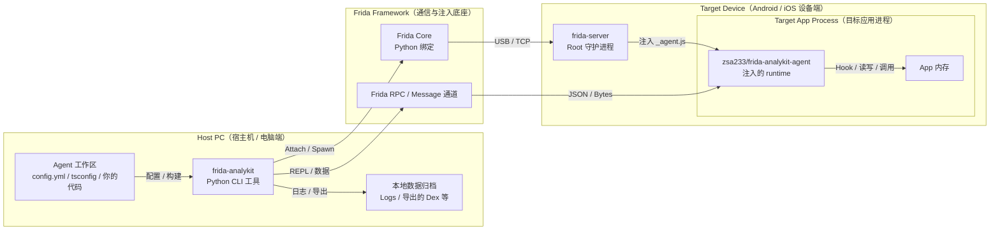

# Frida-Analykit

[](https://github.com/zsa233/frida-analykit/stargazers)
[](LICENSE)

🌍 语言: 中文 | [English](README_EN.md)

`frida-analykit` v2 是一个双产物 monorepo：Python CLI 负责环境、构建、注入和数据归档，npm runtime `@zsa233/frida-analykit-agent` 负责自定义 TypeScript Frida agent 的运行时能力。

## 项目定位

- Python CLI：负责 `frida-server` 生命周期、设备连接、构建编排、attach/spawn、REPL、日志与二进制数据落盘。
- npm runtime：发布为 `@zsa233/frida-analykit-agent`，提供 RPC、helper、JNI、ELF、SSL、Dex dump 和部分 native binding。
- v2 的主线模式是“用户维护独立 TypeScript agent 工作区，CLI 负责构建、注入和结果归档”。

## 架构说明图



## 兼容策略

- Python 依赖范围：`frida>=16.5.9,<18`
- 当前受测 profile：`legacy-16` 的 `16.5.9` 与 `current-17` 的 `17.8.2`
- `frida-analykit doctor` 会把当前环境标记为 `tested`、`supported but untested` 或 `unsupported`

先检查当前环境：

```sh
frida-analykit doctor
```

## 普通用户：安装 Python CLI

Python 包通过 GitHub 仓库 / GitHub Release 分发，不发布到 PyPI。

推荐直接用 `uv` 安装：

```sh
uv tool install "git+https://github.com/ZSA233/frida-analykit@v2.0.6"
```

如果你需要维护多套 Frida 版本环境，可以使用内置环境管理：

```sh
frida-analykit env create --frida-version 16.5.9 --name legacy-16
frida-analykit env create --frida-version 17.8.2 --name current-17
frida-analykit env list
frida-analykit env use legacy-16
frida-analykit env shell
frida-analykit env remove legacy-16
```

## 普通用户：主线工作流

下面这条主线流程假设你已经有一个可运行的 agent 工作区，或者已经从模板仓库拿到了 `config.yml` 和 `index.ts`。

1. 准备好 Python 环境与目标设备连接。
2. 先用 `doctor` 检查当前 Frida 版本、设备连通性和 `frida-server` 状态。
3. 如有需要，安装并启动远端 `frida-server`。
4. 编译 `_agent.js`，然后执行 `spawn` 或 `attach`。
5. 需要交互式调试时，追加 `--repl` 进入 async `ptpython`。

```sh
frida-analykit doctor --config ./config.yml
frida-analykit server install --config ./config.yml
frida-analykit server boot --config ./config.yml
frida-analykit build --config ./config.yml
frida-analykit spawn --config ./config.yml
frida-analykit attach --config ./config.yml --build --repl
```

## 常用配置与命令

`config.yml` 顶层常用字段包括：

- `app`：目标包名；`spawn` 时必须提供，`attach` 时可作为 PID 自动解析依据。
- `jsfile`：编译产物 `_agent.js` 路径。
- `server`：设备与 `frida-server` 连接信息。
- `agent`：Python 侧日志与二进制数据输出路径。
- `script`：agent 侧扩展配置；当前包括 `rpc.batch_max_bytes`、`repl.globals`、`nettools.ssl_log_secret`、`dextools.dex_dir`。

```yml
app: com.example.demo
jsfile: ./_agent.js

server:
  servername: /data/local/tmp/frida-server
  host: 127.0.0.1:27042
  device:
  version:

agent:
  datadir: ./data
  stdout: ./logs/stdout.log
  stderr: ./logs/stderr.log

script:
  rpc:
    batch_max_bytes: 8388608
  repl:
    globals:
      - Process
      - Module
      - Memory
      - Java
      - ObjC
      - Swift
  nettools:
    ssl_log_secret: ./data/nettools/sslkey
  dextools:
    dex_dir: ./data/dextools
```

常用命令：

```sh
frida-analykit build --config ./config.yml
frida-analykit watch --config ./config.yml
frida-analykit spawn --config ./config.yml
frida-analykit attach --config ./config.yml --pid 12345
frida-analykit attach --config ./config.yml --watch --repl
frida-analykit doctor --config ./config.yml --verbose
frida-analykit server stop --config ./config.yml
frida-analykit server install --config ./config.yml --version 17.8.2
frida-analykit server install --config ./config.yml --local-server ./frida-server-17.8.2-android-arm64.xz
```

使用时需要特别记住：

- `spawn` 要求 `config.app` 必填；`attach` 可显式传 `--pid`。
- `--build` / `--watch` 会复用工作区里的 `npm run build` / `npm run watch`。
- `attach --watch` / `spawn --watch` 的语义是“等待首个成功构建后再注入”，不会热重载已有 session。
- `spawn` / `attach` 不会自动启动远端 `frida-server`；远端链路应先执行 `server boot`。
- `server.host` 支持 `host:port`、`local`、`usb`，`server.device` 用于固定目标设备序列号。
- `server boot` 默认不会杀掉已有远端 `frida-server`；如需强制替换，使用 `--force-restart`。
- `server stop` 是幂等清理入口，即使远端当前没有匹配进程也会返回成功。
- `script.rpc.batch_max_bytes` 是通用 RPC batch 上限，不只作用于 dex dump。
- `script.dextools.dex_dir` 是 Python 侧接收 dex dump 的默认目录。

## Agent 能力概览

如果你需要扩展 agent 运行时能力，建议显式导入对应 capability subpath。更完整的包级说明见 [packages/frida-analykit-agent/README.md](packages/frida-analykit-agent/README.md) 和 [packages/frida-analykit-agent/README_EN.md](packages/frida-analykit-agent/README_EN.md)。

| 能力 | 导入路径 | 主要用途 | 是否默认轻入口可见 |
|:---|:---|:---|:---|
| `rpc` | `@zsa233/frida-analykit-agent/rpc` | 安装最小 RPC / REPL runtime | 否 |
| `helper` | `@zsa233/frida-analykit-agent/helper` | 访问日志、文件、内存、运行时 facade | 是 |
| `process` | `@zsa233/frida-analykit-agent/process` | 访问 `proc` 和进程映射辅助能力 | 是 |
| `jni` | `@zsa233/frida-analykit-agent/jni` | 使用 `JNIEnv`、JNI wrapper 和显式签名调用 | 否 |
| `ssl` | `@zsa233/frida-analykit-agent/ssl` | 使用 `SSLTools`、BoringSSL 定位和 keylog 辅助 | 否 |
| `elf` | `@zsa233/frida-analykit-agent/elf` | 解析 ELF、查找模块和符号 | 否 |
| `dex` | `@zsa233/frida-analykit-agent/dex` | 枚举 class loader dex 并流式 dump | 否 |
| `native/libart` | `@zsa233/frida-analykit-agent/native/libart` | 访问 ART 低层符号绑定 | 否 |
| `native/libssl` | `@zsa233/frida-analykit-agent/native/libssl` | 访问 OpenSSL / BoringSSL 低层符号绑定 | 否 |
| `native/libc` | `@zsa233/frida-analykit-agent/native/libc` | 访问 libc 低层封装和常见系统调用 | 否 |

## 高级/开发用户：生成与开发 TypeScript Agent

这是 v2 的主线开发模式：Python CLI 负责环境与注入，用户在独立的 TypeScript 工作区维护自己的 agent。

```sh
frida-analykit gen dev --work-dir ./my-agent
cd my-agent
npm install
```

生成后的工作区结构：

```text
my-agent/
├── README.md
├── config.yml
├── index.ts
├── package.json
└── tsconfig.json
```

最小 agent 只需要安装 `/rpc`：

```ts
import "@zsa233/frida-analykit-agent/rpc"

setImmediate(() => {
  console.log("pid =", Process.id)
})
```

如果需要更多能力，推荐显式使用 capability subpath：

```ts
import "@zsa233/frida-analykit-agent/rpc"
import { help } from "@zsa233/frida-analykit-agent/helper"
import "@zsa233/frida-analykit-agent/process"
import { JNIEnv } from "@zsa233/frida-analykit-agent/jni"
import { SSLTools } from "@zsa233/frida-analykit-agent/ssl"
import { Libssl } from "@zsa233/frida-analykit-agent/native/libssl"

setImmediate(() => {
  console.log("pid =", Process.id)
  console.log("api level =", help.runtime.androidApiLevel())
  console.log("env =", JNIEnv.$handle)
  console.log("ssl guesses =", SSLTools.guess().length)
  console.log("maps =", proc.loadProcMap().items.length)
  console.log("libssl module =", Libssl.$getModule().name)
})
```

开发时需要特别记住：

- 生成的 `package.json` 会固定到与当前 CLI release 对应的 `@zsa233/frida-analykit-agent` 版本。
- 包根 `@zsa233/frida-analykit-agent` 是瘦入口，较重能力应显式通过 subpath 导入。
- 只有在 `index.ts` 中显式 import 的 capability 才会进入 `_agent.js`，并出现在 RPC eval context 中。
- `frida-analykit build` / `watch` 会复用工作区的 `npm run build` / `npm run watch`。

## 高级/开发用户：REPL 与运行时能力

`--repl` 会进入 async `ptpython`，并注入 `config`、`device`、`pid`、`session`、`script` 这些对象。

```sh
frida-analykit attach --config ./config.yml --build --repl
```

REPL 与 runtime 的关键行为包括：

- `script.repl.globals` 会懒注入一组 JS seed handle，模板默认包括 `Process`、`Module`、`Memory`、`Java`、`ObjC`、`Swift`。
- 这些名字会在首次真实使用时 materialize 成 `script.jsh(name)` 对应句柄，而不是在进入 REPL 时立即 enumerate。
- 常用路径包括 `script.eval("Process.arch")`、`await script.eval_async("Promise.resolve(Process.arch)")`、`handle.value_`、`handle.type_`、`await handle.resolve_async()`。
- 句柄元信息使用 `.value_` / `.type_`，不占用真实 JS 属性 `.value` / `.type`。
- 如果设备上加载的是旧 `_agent.js`，Python 侧会直接抛出 `RPC runtime mismatch`，提示重新打包当前 runtime 并 rebuild。

## 高级/开发用户：Dex Dump 与 Runtime Capability

如果需要枚举和导出 ART 中已加载的 dex，可显式导入 `/dex` capability：

```ts
import "@zsa233/frida-analykit-agent/rpc"
import { DexTools } from "@zsa233/frida-analykit-agent/dex"

setImmediate(() => {
  const loaders = DexTools.enumerateClassLoaderDexFiles()
  console.log("dex loaders =", loaders.length)
  DexTools.dumpAllDex({ tag: "manual" })
})
```

Dex dump 的当前行为包括：

- `DexTools.dumpAllDex()` 会走 `DEX_DUMP_BEGIN -> BATCH(DEX_DUMP_FILES) -> DEX_DUMP_END` 的流式链路。
- `script.rpc.batch_max_bytes` 是通用 RPC batch 上限；agent 侧默认读取 `Config.BatchMaxBytes`，也可用 `dumpAllDex({ maxBatchBytes })` 按次覆盖。
- Python 侧默认输出目录优先取 `script.dextools.dex_dir`，未配置时回退到 `agent.datadir/dextools`。
- 单个 dex 即使超过批量上限，也会单独成批发送，不继续做更细粒度切片。

## 调试、真机测试、发布与仓库结构

仓库内置了一组 Android 真机测试，不依赖外部示例工程。它们会在临时目录里生成最小 `_agent.js + config.yml`，覆盖 `frida-server` 生命周期、注入链路、REPL 核心路径和 runtime 安装回归。

运行前需要：

- `FRIDA_ANALYKIT_ENABLE_DEVICE=1`
- `FRIDA_ANALYKIT_DEVICE_APP=<package>`
- 可选 `ANDROID_SERIAL=<serial>`
- 可选 `FRIDA_ANALYKIT_DEVICE_LOCAL_SERVER=<path>`

```sh
make device-check
make device-test-core
make device-test-install
make device-test-repl-handlers
make device-test
```

发布与仓库结构的关键入口包括：

- Python 包通过 GitHub Release 分发，npm runtime 通过 npmjs 分发。
- Python 与 npm 共用同一个版本号，版本真源在 `release-version.toml`。
- 支持范围真源在 `pyproject.toml` 中的 `frida>=...,<...`，受测 profile 真源在 `src/frida_analykit/resources/compat_profiles.json`。
- 发版 runbook 在 `docs/release-process.md`，README 收束基线在 `PRE_README.MD`。
- 示例仓库见 [android-reverse-examples](https://github.com/ZSA233/android-reverse-examples)。

```text
src/frida_analykit/                # Python CLI 和会话编排
packages/frida-analykit-agent/     # npm runtime
scripts/                           # 发布与构建辅助脚本
tests/                             # Python 测试
.github/workflows/                 # CI 与发布工作流
```
