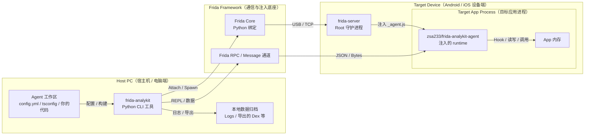

# Frida-Analykit

[](https://github.com/zsa233/frida-analykit/stargazers)
[](LICENSE)

🌍 语言: 中文 | [English](README_EN.md)

`frida-analykit` v2 是一个双产物 monorepo：Python CLI 负责环境、构建、注入和数据归档，npm runtime `@zsa233/frida-analykit-agent` 负责自定义 TypeScript Frida agent 的运行时能力。

## 项目定位

- Python CLI：负责 `frida-server` 生命周期、设备连接、构建编排、attach/spawn、REPL、日志与二进制数据落盘。
- Python 安装还会同时提供独立命令 `frida-analykit-mcp`，用于把当前 Frida 调试链路暴露成 stdio MCP server。
- npm runtime：发布为 `@zsa233/frida-analykit-agent`，提供 RPC、helper、JNI、ELF、SSL、Dex dump 和部分 native binding。
- v2 的主线模式是“用户维护独立 TypeScript agent 工作区，CLI 负责构建、注入和结果归档”。

## 架构说明图



## 兼容策略

- Python 依赖范围：`frida>=16.5.9,<18`
- 当前受测 profile：`legacy-16` 的 `16.5.9` 与 `current-17` 的 `17.8.2`
- `frida-analykit doctor` 会输出带颜色的精简诊断摘要，直接标出版本错配、host 不可达、协议不兼容等红项；`--verbose` 才展开完整细节
- `frida-analykit doctor fix` 会修复远端 `frida-server` 的安装 / 版本类红项，但不会自动 `server boot`
- `frida-analykit doctor device-compat` 可以对一台或多台真机做最小注入式 Frida 版本兼容性采样，默认采样 `3` 轮并实时输出阶段进度；默认使用仓库内置测试包 `com.frida_analykit.test`

先检查当前环境：

```sh
frida-analykit doctor
frida-analykit doctor fix --config ./config.toml
frida-analykit doctor device-compat --all-devices
```

## 普通用户：安装 Python CLI

Python 包通过 GitHub 仓库 / GitHub Release 分发，不发布到 PyPI。

推荐直接用 `uv` 安装：

```sh
uv tool install "git+https://github.com/ZSA233/frida-analykit@stable"
```

同一安装会同时提供 `frida-analykit` 与 `frida-analykit-mcp` 两个命令入口。

如果你需要维护多套 Frida 版本环境，可以使用内置环境管理：

```sh
frida-analykit env create --frida-version 16.5.9 --name legacy-16
frida-analykit env create --frida-version 17.8.2 --name current-17
frida-analykit env list
frida-analykit env use legacy-16
frida-analykit env shell
frida-analykit env remove legacy-16
```

## 普通用户：主线工作流

下面这条主线流程假设你已经有一个可运行的 agent 工作区，或者已经从模板仓库拿到了 `config.toml` 和 `index.ts`。

1. 准备好 Python 环境与目标设备连接。
2. 先用 `doctor` 检查当前 Frida 版本、设备连通性和 `frida-server` 状态。
3. 如果 `doctor` 标出远端 `frida-server` 的安装 / 版本红项，可先执行 `doctor fix`；运行态红项仍需手动 `server boot`。
4. 如有需要，安装并启动远端 `frida-server`。
5. 编译 `_agent.js`，然后执行 `spawn` 或 `attach`。
6. 需要交互式调试时，追加 `--repl` 进入 async `ptpython`。

```sh
frida-analykit doctor --config ./config.toml
frida-analykit doctor fix --config ./config.toml
frida-analykit server install --config ./config.toml
frida-analykit server boot --config ./config.toml
frida-analykit build --config ./config.toml
frida-analykit spawn --config ./config.toml
frida-analykit attach --config ./config.toml --build --repl
```

如果你要把当前设备链路交给 MCP client / 大模型，可在宿主机上另开一个终端运行：

```sh
frida-analykit-mcp --config ./mcp.toml
```

连接后建议先读取 `frida://service/config`、`frida://docs/mcp/config`、`frida://docs/mcp/index`、`frida://docs/mcp/quickstart` 与 `frida://docs/mcp/workflow`，用 `frida://service/config` 读取当前 MCP 进程固定下来的默认值，并确认 `quick_path.state` 是否已经是 `ready`，然后优先调用 `session_open_quick`，再决定具体的 `eval_js` 与 snippet 管理步骤。

`session_open(config_path, ...)` 仍然保留给显式 workspace，但它是 MCP 成功启动后的低层会话入口，不是 quick warmup 失败时的启动绕过路径。

## 常用配置与命令

`config.toml` 顶层常用字段包括：

- `app`：目标包名；`spawn` 时必须提供，`attach` 时可作为 PID 自动解析依据。
- `jsfile`：编译产物 `_agent.js` 路径。
- `server`：设备与 `frida-server` 连接信息。
- `agent`：Python 侧日志与二进制数据输出路径。
- `script`：agent 侧扩展配置；当前包括 `rpc.batch_max_bytes`、`repl.globals`、`nettools.ssl_log_secret`、`dextools.output_dir`。

```toml
app = "com.example.demo"
jsfile = "./_agent.js"

[server]
path = "/data/local/tmp/frida-server"
host = "127.0.0.1:27042"

[agent]
datadir = "./data"
stdout = "./logs/stdout.log"
stderr = "./logs/stderr.log"

[script.rpc]
batch_max_bytes = 8388608

[script.repl]
globals = ["Process", "Module", "Memory", "Java", "ObjC", "Swift"]

[script.nettools]
ssl_log_secret = "./data/nettools/sslkey"

[script.dextools]
output_dir = "./data/dextools"
```

兼容说明：

- 主线配置文件名已经切到 `config.toml`。
- 旧的 `config.yml` / `config.yaml` 仍可继续读取。
- `server.path` 是新的主字段；旧的 `server.servername` 仍保留输入兼容。

常用命令：

```sh
frida-analykit build --config ./config.toml
frida-analykit watch --config ./config.toml
frida-analykit spawn --config ./config.toml
frida-analykit attach --config ./config.toml --pid 12345
frida-analykit attach --config ./config.toml --watch --repl
frida-analykit doctor --config ./config.toml --verbose
frida-analykit doctor fix --config ./config.toml
frida-analykit server stop --config ./config.toml
frida-analykit server install --config ./config.toml --version 17.8.2
frida-analykit server install --config ./config.toml --local-server ./frida-server-17.8.2-android-arm64.xz
```

如果你要把当前设备会话交给 MCP client，也可以直接启动独立 stdio server：

```sh
frida-analykit-mcp --config ./mcp.toml
```

连接后建议先读取 `frida://service/config`、`frida://docs/mcp/config`、`frida://docs/mcp/index`、`frida://docs/mcp/quickstart` 与 `frida://docs/mcp/workflow`，用 `frida://service/config` 读取当前 MCP 进程固定下来的默认值，并确认 `quick_path.state` 是否已经是 `ready`，然后优先调用 `session_open_quick`，再决定具体的 `eval_js` 与 snippet 管理步骤。

使用时需要特别记住：

- `spawn` 要求 `config.app` 必填；`attach` 可显式传 `--pid`。
- `--build` / `--watch` 会复用工作区里的 `npm run build` / `npm run watch`。
- `attach --watch` / `spawn --watch` 的语义是“等待首个成功构建后再注入”，不会热重载已有 session。
- `spawn` / `attach` 不会自动启动远端 `frida-server`；远端链路应先执行 `server boot`。
- `doctor` 默认只展示关键结论和行动提示；`--verbose` 才展开 support range、profile、原始 config 字段和低层探测细节。
- `doctor fix` 只修远端 `frida-server` 的安装 / 版本问题；修完后若仍提示运行态红项，需要再手动执行 `server boot`。
- `server.host` 支持 `host:port`、`local`、`usb`，`server.device` 用于固定目标设备序列号，且优先级高于 `ANDROID_SERIAL`。
- `server boot` 只会启动设备上现有的远端 binary，不会自动安装或切换成当前 Python Frida 对应版本。
- `server boot` 默认不会杀掉已有远端 `frida-server`；如需强制替换，使用 `--force-restart`。
- `server stop` 是幂等清理入口，即使远端当前没有匹配进程也会返回成功。
- `script.rpc.batch_max_bytes` 是通用 RPC batch 上限，不只作用于 dex dump。
- `script.dextools.output_dir` 是 Python 侧接收 dex dump 的默认目录。
- `frida-analykit-mcp` 当前只支持 stdio transport，默认只维护一个活动调试会话。
- `frida-analykit-mcp` 支持可选的 `--config ./mcp.toml` 启动配置；未提供时使用内建默认值，`--idle-timeout` 仍可覆盖空闲回收时间。
- `frida-analykit-mcp` 启动时会先做 quick-path preflight + warmup，再进入 stdio serve；如果 `prepared_cache_root` 不可写，或 MCP 进程 `PATH` 中缺少 `frida-compile` / `npm`，或 compile probe 失败，服务会直接非零退出。
- 启动 banner 会在 `stderr` 打印 quick-path 状态块；`frida://service/config` 也会返回同一份结构化 `quick_path` readiness 摘要，适合先让 MCP client 确认 `quick_path.state == "ready"`。
- `frida://service/config` 还会暴露实际生效的 `session_history_root`；每个真实 MCP 会话都会在这个目录下创建 `{yyyyMMdd-HHMMSS-shortid}` 形式的会话归档目录。
- MCP 还会暴露 `frida://service/config`，以及 `frida://docs/mcp/index`、`frida://docs/mcp/config`、`frida://docs/mcp/quickstart`、`frida://docs/mcp/workflow`、`frida://docs/mcp/tools`、`frida://docs/mcp/recovery` 六个可查询 Markdown 资源，适合先给大模型读一遍再开会话。
- MCP 推荐起手式是 `session_open_quick`：它会在 MCP 专用缓存目录中自动生成最小工作区、复用共享轻量 runtime 依赖缓存、通过 MCP 进程 `PATH` 中预装的 `frida-compile` 构建 `_agent.js`、写出继承 startup config 的 `config.toml`，并复用相同参数签名的缓存结果。
- quick generator 会在生成的 `index.ts` 中对 capability 做显式本地引用；如果你自己维护 `bootstrap_path` 或自定义 workspace，也建议显式 import 并引用所需 binding，而不是依赖 bare import 是否会被 bundler 保留。
- `session_open` 仍保留为底层显式入口，适用于你已经自定义维护好的 `config.toml` 或 legacy YAML 配置工作区。
- quick path 只允许官方 `@zsa233/frida-analykit-agent` capability subpath / 模板名，不开放任意 npm 包，也不会接管 watch / hot reload。
- quick path 不会在每个 prepared workspace 里安装 `frida-compile`、`frida` 或 `@types/node`；它复用的是 `prepared_cache_root/npm-cache` 和 `prepared_cache_root/_toolchains/<digest>` 这套 shared cache，而不是按 Python 虚拟环境拆分的独立 npm cache。
- `session_open_quick` 同时支持 `bootstrap_path` 与 `bootstrap_source`：前者适合直接复用仓库里的 `.ts` / `.js` 文件，后者适合一次性的内联初始化 hook；两者都不进入 snippet registry。
- `prepared_cache_root` 继续只承担内部 quick cache 角色；用户后续要查看的 effective workspace、`session.json`、`events.jsonl` 和持久化 snippet 源码，都位于 `session_history_root` 下的会话目录中。
- `install_snippet` 成功后会把源码归档到当前会话目录，但这只是历史记录，不会在后续新会话中自动 replay。

## Agent 能力概览

如果你需要扩展 agent 运行时能力，建议显式导入对应 capability subpath。更完整的包级说明见 [packages/frida-analykit-agent/README.md](packages/frida-analykit-agent/README.md) 和 [packages/frida-analykit-agent/README_EN.md](packages/frida-analykit-agent/README_EN.md)。

| 能力 | 导入路径 | 主要用途 | 是否默认轻入口可见 |
|:---|:---|:---|:---|
| `rpc` | `@zsa233/frida-analykit-agent/rpc` | 安装最小 RPC / REPL runtime | 否 |
| `helper` | `@zsa233/frida-analykit-agent/helper` | 访问日志、文件、内存、运行时 facade | 是 |
| `process` | `@zsa233/frida-analykit-agent/process` | 访问 `proc` 和进程映射辅助能力 | 是 |
| `jni` | `@zsa233/frida-analykit-agent/jni` | 使用 `JNIEnv`、JNI wrapper 和显式签名调用 | 否 |
| `ssl` | `@zsa233/frida-analykit-agent/ssl` | 使用 `SSLTools`、BoringSSL 定位和 keylog 辅助 | 否 |
| `elf` | `@zsa233/frida-analykit-agent/elf` | 解析 ELF、查找模块和符号 | 否 |
| `dex` | `@zsa233/frida-analykit-agent/dex` | 枚举 class loader dex 并流式 dump | 否 |
| `native/libart` | `@zsa233/frida-analykit-agent/native/libart` | 访问 ART 低层符号绑定 | 否 |
| `native/libssl` | `@zsa233/frida-analykit-agent/native/libssl` | 访问 OpenSSL / BoringSSL 低层符号绑定 | 否 |
| `native/libc` | `@zsa233/frida-analykit-agent/native/libc` | 访问 libc 低层封装和常见系统调用 | 否 |

## 高级/开发用户：生成与开发 TypeScript Agent

这是 v2 的主线开发模式：Python CLI 负责环境与注入，用户在独立的 TypeScript 工作区维护自己的 agent。

```sh
frida-analykit gen dev --work-dir ./my-agent
cd my-agent
npm install
```

生成后的工作区结构：

```text
my-agent/
├── README.md
├── config.toml
├── index.ts
├── package.json
└── tsconfig.json
```

最小 agent 只需要安装 `/rpc`：

```ts
import "@zsa233/frida-analykit-agent/rpc"

setImmediate(() => {
  console.log("pid =", Process.id)
})
```

如果需要更多能力，推荐显式使用 capability subpath：

```ts
import "@zsa233/frida-analykit-agent/rpc"
import { help } from "@zsa233/frida-analykit-agent/helper"
import "@zsa233/frida-analykit-agent/process"
import { JNIEnv } from "@zsa233/frida-analykit-agent/jni"
import { SSLTools } from "@zsa233/frida-analykit-agent/ssl"
import { Libssl } from "@zsa233/frida-analykit-agent/native/libssl"

setImmediate(() => {
  console.log("pid =", Process.id)
  console.log("api level =", help.runtime.androidApiLevel())
  console.log("env =", JNIEnv.$handle)
  console.log("ssl guesses =", SSLTools.guess().length)
  console.log("maps =", proc.loadProcMap().items.length)
  console.log("libssl module =", Libssl.$getModule().name)
})
```

开发时需要特别记住：

- 生成的 `package.json` 会固定到与当前 CLI release 对应的 `@zsa233/frida-analykit-agent` 版本。
- 包根 `@zsa233/frida-analykit-agent` 是瘦入口，较重能力应显式通过 subpath 导入。
- 只有在 `index.ts` 中显式 import 的 capability 才会进入 `_agent.js`，并出现在 RPC eval context 中。
- `frida-analykit build` / `watch` 会复用工作区的 `npm run build` / `npm run watch`。

## 高级/开发用户：REPL 与运行时能力

`--repl` 会进入 async `ptpython`，并注入 `config`、`device`、`pid`、`session`、`script` 这些对象。

```sh
frida-analykit attach --config ./config.toml --build --repl
```

REPL 与 runtime 的关键行为包括：

- `script.repl.globals` 会懒注入一组 JS seed handle，模板默认包括 `Process`、`Module`、`Memory`、`Java`、`ObjC`、`Swift`。
- 普通 CLI / REPL 暴露的 `script` 默认就是 sync-first wrapper；async wrapper 只保留给 Promise-aware expert 场景和 MCP 内核。
- 这些名字会在首次真实使用时 materialize 成 `script.jsh(name)` 对应句柄，而不是在进入 REPL 时立即 enumerate。
- REPL 默认推荐用 `script.eval(...)` / `script.jsh(...)` 拿 sync handle 做对象浏览、getter 读取和长属性链；例如 `script.eval("DexTools").fileName.value_`。
- async 路径主要用于 Promise-aware 场景，例如 `await script.eval_async("Promise.resolve(Process.arch)")`、`await handle.call_async(...)` 和 `await handle.resolve_async()`。
- `script.eval("Promise.resolve(Process.arch)")` 会返回 Promise 句柄，不会自动 await；`await script.eval_async("Promise.resolve(Process.arch)")` 则会在 agent 侧先 await 一层 Promise，再返回 resolved value 的 async handle。
- 当前 async handle 不提供和 sync handle 完全对称的属性链浏览；如果必须在 async handle 上访问子路径，应显式使用 `await handle.resolve_path_async("a.b.c")`。
- 句柄元信息使用 `.value_` / `.type_`，不占用真实 JS 属性 `.value` / `.type`。
- async RPC 路径会按当前已加载 script 的真实 capability 选择 native async 或 shim async；compat profile 只用于诊断与测试口径，不参与运行时分流。
- 如果设备上加载的是旧 `_agent.js`，Python 侧会直接抛出 `RPC runtime mismatch`，提示重新打包当前 runtime 并 rebuild。

## 高级/开发用户：Dex Dump 与 Runtime Capability

如果需要枚举和导出 ART 中已加载的 dex，可显式导入 `/dex` capability：

```ts
import "@zsa233/frida-analykit-agent/rpc"
import { DexTools } from "@zsa233/frida-analykit-agent/dex"

setImmediate(() => {
  const loaders = DexTools.enumerateClassLoaderDexFiles()
  console.log("dex loaders =", loaders.length)
  DexTools.dumpAllDex({ tag: "manual" })
})
```

Dex dump 的当前行为包括：

- `DexTools.dumpAllDex()` 会走 `DEX_DUMP_BEGIN -> BATCH(DEX_DUMP_FILES) -> DEX_DUMP_END` 的流式链路。
- `script.rpc.batch_max_bytes` 是通用 RPC batch 上限；agent 侧默认读取 `Config.BatchMaxBytes`，也可用 `dumpAllDex({ maxBatchBytes })` 按次覆盖。
- Python 侧默认输出目录优先取 `script.dextools.output_dir`，未配置时回退到 `agent.datadir/dextools`。
- 单个 dex 即使超过批量上限，也会单独成批发送，不继续做更细粒度切片。

## 调试、真机测试、发布与仓库结构

仓库内置了一组 Android 真机测试，不依赖外部示例工程。它们会在临时目录里生成最小 `_agent.js + config` 工作区，覆盖 `frida-server` 生命周期、注入链路、REPL 核心路径和 runtime 安装回归。

运行前需要：

- `FRIDA_ANALYKIT_ENABLE_DEVICE=1`
- 可选 `FRIDA_ANALYKIT_DEVICE_SKIP_APP_TESTS=1`
- 可选 `ANDROID_SERIAL=<serial>`
- 可选 `FRIDA_ANALYKIT_DEVICE_LOCAL_SERVER=<path>`
- 默认测试包 `com.frida_analykit.test` 已安装到目标设备，或显式设置 `FRIDA_ANALYKIT_DEVICE_APP=<package>`

真机用例默认会使用仓库内置的最小 Android 测试 APK `tests/android_test_app/`，包名固定为 `com.frida_analykit.test`。这部分不会在跑测试时自动构建或自动安装；若默认包未安装，会直接失败并提示安装命令。对应版本的 GitHub Release / prerelease 也会提供可直接安装的 `frida-analykit-device-test-app-vX.Y.Z[-rc.N].apk`，可直接下载后执行 `adb install -r`。该 APK 使用仓库内固定的测试签名，仅用于真机回归与兼容性验证，不用于生产发布。若只想快速验证不依赖 app 的链路，可对 `make device-*` 传入 `DEVICE_TEST_SKIP_APP=1`，或在直接运行 `pytest` 时设置 `FRIDA_ANALYKIT_DEVICE_SKIP_APP_TESTS=1`。

普通真机测试默认会在同一台设备的整个 pytest session 内复用一个 `frida-server` runtime，降低旧设备在频繁 stop / reboot 后出现系统重启的概率。多台设备同时在线时，普通 `make device-test*` 需要显式提供 `ANDROID_SERIAL=<serial>`；如果要并行跑所有已连接设备，可使用 `make device-test-all`。`doctor device-compat` 在未显式提供 `--app` 且配置里未设置 `app` 时，也会直接使用这个默认测试包。

```sh
make device-test-app-build
make device-test-app-install ANDROID_SERIAL=<serial>
make device-test-app-install-all
make device-check
make device-test-core
make device-test-install
make device-test-repl-handlers
make device-test
make device-test DEVICE_TEST_SKIP_APP=1
make device-test-all
```

发布与仓库结构的关键入口包括：

- Python 包通过 GitHub Release 分发，npm runtime 通过 npmjs 分发。
- 默认真机测试 APK 也会随对应 GitHub Release 一起发布，文件名为 `frida-analykit-device-test-app-vX.Y.Z[-rc.N].apk`。
- Python 与 npm 共用同一个版本号，版本真源在 `release-version.toml`。
- 支持范围真源在 `pyproject.toml` 中的 `frida>=...,<...`，受测 profile 真源在 `src/frida_analykit/resources/compat_profiles.json`。
- 发版 runbook 在 `docs/release-process.md`，README 收束基线在 `PRE_README.MD`。
- 示例仓库见 [android-reverse-examples](https://github.com/ZSA233/android-reverse-examples)。

```text
src/frida_analykit/                # Python CLI 和会话编排
packages/frida-analykit-agent/     # npm runtime
scripts/                           # 发布与构建辅助脚本
tests/                             # Python 测试
.github/workflows/                 # CI 与发布工作流
```
