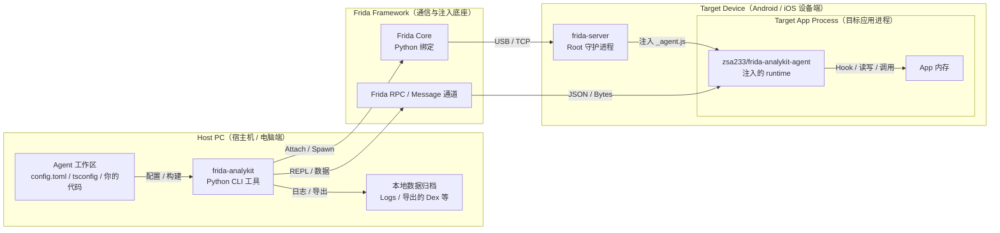

# Frida-Analykit

[](https://github.com/zsa233/frida-analykit/stargazers)
[](LICENSE)

🌍 语言: 中文 | [English](README_EN.md)

`frida-analykit` v2 是一个双产物 monorepo：Python CLI 负责编排 Frida 环境、构建、注入、REPL、MCP 和数据落盘；npm runtime `@zsa233/frida-analykit-agent` 负责给自定义 TypeScript Frida agent 提供按需导入的运行时能力。

## 项目定位

- `frida-analykit` 是主 CLI，覆盖环境管理、工作区生成、`frida-server` 安装/启动、attach/spawn、REPL 和真机辅助检查。
- `frida-analykit-mcp` 是 stdio MCP server，可以把 Frida 调试链路交给 MCP client 或大模型工具流。
- `@zsa233/frida-analykit-agent` 是 agent runtime 包，提供 RPC、helper、process、JNI、ELF、SSL、Dex 和 native binding 等能力。
- 当前支持范围是 `frida>=16.5.9,<18`；实际设备和版本兼容性以 `frida-analykit doctor` 的检查结果为准。

## 快速开始

1. 安装 CLI，得到 `frida-analykit` 和 `frida-analykit-mcp`。

```sh
uv tool install "git+https://github.com/ZSA233/frida-analykit@stable"
```

2. 创建并进入一个固定 Frida 版本的虚拟环境。

```sh
frida-analykit env create --frida-version 17.8.2 --name frida-17.8.2
frida-analykit env shell frida-17.8.2
```

3. 确认 Android 设备已连接。

```sh
adb devices
```

4. 生成 TypeScript agent 工作区并安装依赖。

```sh
frida-analykit gen dev --work-dir ./my-agent
cd ./my-agent
npm install
```

5. 按生成工作区里的 `README.md` 修改 `config.toml`，然后先做环境检查。

```sh
frida-analykit doctor --config ./config.toml
```

6. 如果 `doctor` 提示远端 `frida-server` 安装或版本问题，先修复并启动设备端 server。

```sh
frida-analykit doctor fix --config ./config.toml
frida-analykit server boot --config ./config.toml
```

7. 构建、注入并进入 REPL。

```sh
frida-analykit attach --config ./config.toml --build --repl
```

目标 app 还没启动时，用 `frida-analykit spawn --config ./config.toml --build` 代替最后一步。

## 文档索引

| 主题 | 文档 |
|:---|:---|
| 工作区配置、`config.toml` 和常用 CLI | [src/frida_analykit/resources/scaffold/README.md](src/frida_analykit/resources/scaffold/README.md) |
| MCP server、quick session、tools 和 resources | [src/frida_analykit/mcp/README.MD](src/frida_analykit/mcp/README.MD) |
| Agent runtime 导入路径和能力表 | [packages/frida-analykit-agent/README.md](packages/frida-analykit-agent/README.md) |
| ELF dump fixups 字段和重放规则 | [docs/elf-fixups.md](docs/elf-fixups.md) |
| 真机回归、失败分类和复跑规则 | [docs/device-regression.md](docs/device-regression.md) |
| 发版流程和发布前检查 | [docs/release-process.md](docs/release-process.md) |
| 示例工程 | [android-reverse-examples](https://github.com/ZSA233/android-reverse-examples) |

MCP 的最小启动入口如下，具体会话流程和错误恢复规则请看上面的 MCP 文档。

```sh
frida-analykit-mcp --config ./mcp.toml
```

## 架构说明图


```mermaid
flowchart LR
    subgraph Host["Host PC（宿主机 / 电脑端）"]
        direction TB
        WorkDir["Agent 工作区<br/>config.toml / tsconfig / 你的代码"]
        CLI["frida-analykit<br/>Python CLI 工具"]
        DataArchive["本地数据归档<br/>Logs / 导出的 Dex 等"]

        WorkDir -->|"配置 / 构建"| CLI
        CLI -->|"日志 / 导出"| DataArchive
    end

    subgraph Framework["Frida Framework（通信与注入底座）"]
        direction TB
        FridaCore["Frida Core<br/>Python 绑定"]
        RPCChannel["Frida RPC / Message 通道"]
    end

    subgraph Device["Target Device（Android / iOS 设备端）"]
        direction TB
        FridaServer["frida-server<br/>Root 守护进程"]

        subgraph App["Target App Process（目标应用进程）"]
            direction TB
            AgentRuntime["zsa233/frida-analykit-agent<br/>注入的 runtime"]
            TargetMem["App 内存"]

            AgentRuntime -->|"Hook / 读写 / 调用"| TargetMem
        end

        FridaServer -->|"注入 _agent.js"| AgentRuntime
    end

    CLI -->|"Attach / Spawn"| FridaCore
    CLI -->|"REPL / 数据"| RPCChannel
    FridaCore -->|"USB / TCP"| FridaServer
    RPCChannel -->|"JSON / Bytes"| AgentRuntime
```
