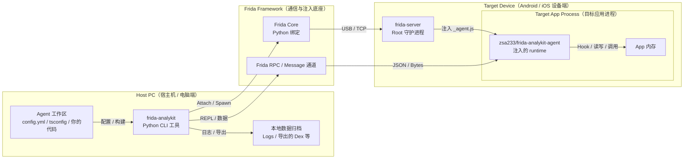

# Frida-Analykit

[](https://github.com/zsa233/frida-analykit/stargazers)
[](LICENSE)

🌍 Language: [中文](README.md) | English

`frida-analykit` v2 is a dual-artifact monorepo: the Python CLI handles environment setup, builds, injection, and data persistence, while the npm runtime `@zsa233/frida-analykit-agent` provides runtime capabilities for custom TypeScript Frida agents.

## Project Positioning

- Python CLI: manages the `frida-server` lifecycle, device connectivity, build orchestration, attach/spawn flows, REPL, logs, and binary payload persistence.
- The Python install also provides a standalone command, `frida-analykit-mcp`, which exposes the current Frida debugging flow as a stdio MCP server.
- npm runtime: published as `@zsa233/frida-analykit-agent`, providing RPC, helper, JNI, ELF, SSL, Dex dump, and selected native bindings.
- The main v2 workflow is: "you maintain an independent TypeScript agent workspace, and the CLI handles build, injection, and result archiving."

## Architecture Diagram



## Compatibility

- Python dependency range: `frida>=16.5.9,<18`
- Current tested profiles: `legacy-16` with `16.5.9`, and `current-17` with `17.8.2`
- `frida-analykit doctor` prints a colorized action-oriented summary and highlights version mismatches, unreachable hosts, and protocol incompatibility directly; use `--verbose` for full detail
- `frida-analykit doctor fix` repairs remote `frida-server` install / version findings, but does not boot the server automatically
- `frida-analykit doctor device-compat` can sample Frida-version compatibility on one or more Android devices through a minimal injection probe, with `3` rounds by default and live stage progress output; it uses the repo-managed test app `com.frida_analykit.test` by default

Check the current environment first:

```sh
frida-analykit doctor
frida-analykit doctor fix --config ./config.toml
frida-analykit doctor device-compat --all-devices
```

## Regular Users: Install The Python CLI

The Python package is distributed through GitHub repositories / GitHub Releases and is not published to PyPI.

The recommended installation uses `uv`:

```sh
uv tool install "git+https://github.com/ZSA233/frida-analykit@stable"
```

The same installation provides both `frida-analykit` and `frida-analykit-mcp`.

If you need to maintain multiple Frida-version environments, you can use the built-in environment manager:

```sh
frida-analykit env create --frida-version 16.5.9 --name legacy-16
frida-analykit env create --frida-version 17.8.2 --name current-17
frida-analykit env list
frida-analykit env use legacy-16
frida-analykit env shell
frida-analykit env remove legacy-16
```

## Regular Users: Main Workflow

The main workflow below assumes that you already have a runnable agent workspace, or that you obtained `config.toml` and `index.ts` from a template repository.

1. Prepare the Python environment and target-device connection.
2. Run `doctor` first to check the current Frida version, device connectivity, and `frida-server` status.
3. If `doctor` reports remote install / version findings, run `doctor fix` first; runtime findings still need a manual `server boot`.
4. Install and boot the remote `frida-server` when needed.
5. Build `_agent.js`, then run `spawn` or `attach`.
6. Add `--repl` when you need interactive debugging in async `ptpython`.

```sh
frida-analykit doctor --config ./config.toml
frida-analykit doctor fix --config ./config.toml
frida-analykit server install --config ./config.toml
frida-analykit server boot --config ./config.toml
frida-analykit build --config ./config.toml
frida-analykit spawn --config ./config.toml
frida-analykit attach --config ./config.toml --build --repl
```

If you want to hand the current device flow to an MCP client / LLM, run this in another terminal on the host:

```sh
frida-analykit-mcp --config ./mcp.toml
```

After connecting, it is recommended to read `frida://service/config`, `frida://docs/mcp/config`, `frida://docs/mcp/index`, `frida://docs/mcp/quickstart`, and `frida://docs/mcp/workflow` first, use `frida://service/config` to read the fixed defaults for the current MCP process, confirm that `quick_path.state` is already `ready`, then start with `session_open_quick` before deciding which `eval_js` and snippet-management steps are needed.

`session_open(config_path, ...)` is still available for explicit workspaces, but it is a low-level session entrypoint after MCP has started successfully, not a startup-bypass path when quick warmup fails.

## Common Config And Commands

Common top-level fields in `config.toml` are:

- `app`: the target package name; required for `spawn`, and also usable as PID-resolution input for `attach`.
- `jsfile`: the compiled `_agent.js` output path.
- `server`: device and `frida-server` connection settings.
- `agent`: Python-side output paths for logs and binary payloads.
- `script`: agent-side extension config; currently includes `rpc.batch_max_bytes`, `repl.globals`, `nettools.ssl_log_secret`, and `dextools.output_dir`.

```toml
app = "com.example.demo"
jsfile = "./_agent.js"

[server]
path = "/data/local/tmp/frida-server"
host = "127.0.0.1:27042"

[agent]
datadir = "./data"
stdout = "./logs/stdout.log"
stderr = "./logs/stderr.log"

[script.rpc]
batch_max_bytes = 8388608

[script.repl]
globals = ["Process", "Module", "Memory", "Java", "ObjC", "Swift"]

[script.nettools]
ssl_log_secret = "./data/nettools/sslkey"

[script.dextools]
output_dir = "./data/dextools"
```

Compatibility notes:

- The mainline config filename is now `config.toml`.
- Legacy `config.yml` / `config.yaml` files are still accepted.
- `server.path` is the new primary field; the old `server.servername` key remains input-compatible.

Common commands:

```sh
frida-analykit build --config ./config.toml
frida-analykit watch --config ./config.toml
frida-analykit spawn --config ./config.toml
frida-analykit attach --config ./config.toml --pid 12345
frida-analykit attach --config ./config.toml --watch --repl
frida-analykit doctor --config ./config.toml --verbose
frida-analykit doctor fix --config ./config.toml
frida-analykit server stop --config ./config.toml
frida-analykit server install --config ./config.toml --version 17.8.2
frida-analykit server install --config ./config.toml --local-server ./frida-server-17.8.2-android-arm64.xz
```

If you want to hand the current device session to an MCP client, you can also start the standalone stdio server directly:

```sh
frida-analykit-mcp --config ./mcp.toml
```

After connecting, it is recommended to read `frida://service/config`, `frida://docs/mcp/config`, `frida://docs/mcp/index`, `frida://docs/mcp/quickstart`, and `frida://docs/mcp/workflow` first, use `frida://service/config` to read the fixed defaults for the current MCP process, confirm that `quick_path.state` is already `ready`, then start with `session_open_quick` before deciding which `eval_js` and snippet-management steps are needed.

Keep these behaviors in mind:

- `spawn` requires `config.app`; `attach` can take an explicit `--pid`.
- `--build` / `--watch` reuse the workspace `npm run build` / `npm run watch`.
- `attach --watch` / `spawn --watch` mean "wait for the first successful build, then inject" and do not hot-reload an existing session.
- `spawn` / `attach` do not boot a remote `frida-server` automatically; for remote flows, run `server boot` first.
- `doctor` shows only key findings and action hints by default; use `--verbose` for support ranges, profiles, raw config fields, and low-level probe details.
- `doctor fix` only repairs remote `frida-server` install / version problems; if runtime findings remain afterwards, run `server boot` manually.
- `server.host` supports `host:port`, `local`, and `usb`, while `server.device` pins the target device serial and takes precedence over `ANDROID_SERIAL`.
- `server boot` only starts the binary that is already present on the device; it does not automatically install or switch to the current Python Frida version.
- `server boot` does not kill an existing remote `frida-server` by default; use `--force-restart` when you need replacement.
- `server stop` is an idempotent cleanup entry and still succeeds when no matching remote process exists.
- `script.rpc.batch_max_bytes` is a global RPC batch limit, not a dex-only setting.
- `script.dextools.output_dir` is the default Python-side output directory for dex dumps.
- `frida-analykit-mcp` currently supports stdio transport only and keeps exactly one active debug session at a time by default.
- `frida-analykit-mcp` supports an optional startup config, `--config ./mcp.toml`; when omitted, built-in defaults are used, and `--idle-timeout` can still override the idle reclaim time.
- `frida-analykit-mcp` now performs quick-path preflight + warmup before entering stdio serve; if `prepared_cache_root` is not writable, if `frida-compile` or `npm` is missing from the MCP process `PATH`, or if the compile probe fails, the service exits non-zero immediately.
- The startup banner prints a quick-path status block on `stderr`, and `frida://service/config` exposes the same structured `quick_path` readiness summary. Prefer confirming `quick_path.state == "ready"` before opening a session.
- `frida://service/config` also exposes the effective `session_history_root`; every real MCP session creates an archive directory there using the form `{yyyyMMdd-HHMMSS-shortid}`.
- MCP also exposes `frida://service/config`, plus six queryable Markdown resources: `frida://docs/mcp/index`, `frida://docs/mcp/config`, `frida://docs/mcp/quickstart`, `frida://docs/mcp/workflow`, `frida://docs/mcp/tools`, and `frida://docs/mcp/recovery`.
- The recommended MCP starting point is `session_open_quick`: it generates a minimal workspace inside the MCP cache, reuses a shared lightweight runtime dependency cache, builds `_agent.js` with the `frida-compile` already available in the MCP process `PATH`, writes `config.toml` inherited from the startup config, and reuses cached artifacts for the same signature.
- The quick generator now keeps capability preloads alive through explicit local references in the generated `index.ts`; if you maintain `bootstrap_path` or a custom workspace yourself, prefer explicit imports plus explicit references instead of assuming a bare import will survive bundler pruning.
- `session_open` remains the low-level explicit entry for custom workspaces where you already maintain `config.toml` or a legacy YAML config together with `_agent.js`.
- The quick path only allows official `@zsa233/frida-analykit-agent` capability subpaths / templates, and it does not take over watch / hot reload.
- The quick path does not install `frida-compile`, `frida`, or `@types/node` into each prepared workspace; it reuses `prepared_cache_root/npm-cache` and `prepared_cache_root/_toolchains/<digest>` as a shared cache instead of creating a separate npm cache per Python virtual environment.
- `session_open_quick` supports both `bootstrap_path` and `bootstrap_source`: the former is for reusing a repo-visible `.ts` / `.js` file, while the latter is for one-off inline initialization hooks. Neither becomes part of the snippet registry.
- `prepared_cache_root` remains an internal quick-cache area; the effective workspace copy, `session.json`, `events.jsonl`, and archived snippet source files that users inspect later all live under `session_history_root`.
- Successful `install_snippet` calls archive the snippet source into the current session directory, but that archive is historical only and is not auto-replayed into later sessions.

## Agent Capability Overview

If you need to expand the agent runtime, prefer explicit capability subpath imports. For the full package-level description, see [packages/frida-analykit-agent/README.md](packages/frida-analykit-agent/README.md) and [packages/frida-analykit-agent/README_EN.md](packages/frida-analykit-agent/README_EN.md).

| Capability | Import Path | Primary Use | Visible From Slim Root Entry |
|:---|:---|:---|:---|
| `rpc` | `@zsa233/frida-analykit-agent/rpc` | Install the minimal RPC / REPL runtime | No |
| `helper` | `@zsa233/frida-analykit-agent/helper` | Access logging, file, memory, and runtime facades | Yes |
| `process` | `@zsa233/frida-analykit-agent/process` | Access `proc` and process-map helpers | Yes |
| `jni` | `@zsa233/frida-analykit-agent/jni` | Use `JNIEnv`, JNI wrappers, and explicit-signature calls | No |
| `ssl` | `@zsa233/frida-analykit-agent/ssl` | Use `SSLTools`, BoringSSL locating, and keylog helpers | No |
| `elf` | `@zsa233/frida-analykit-agent/elf` | Parse ELF files and locate modules or symbols | No |
| `dex` | `@zsa233/frida-analykit-agent/dex` | Enumerate class-loader dex files and dump them in streaming mode | No |
| `native/libart` | `@zsa233/frida-analykit-agent/native/libart` | Access low-level ART symbol bindings | No |
| `native/libssl` | `@zsa233/frida-analykit-agent/native/libssl` | Access low-level OpenSSL / BoringSSL symbol bindings | No |
| `native/libc` | `@zsa233/frida-analykit-agent/native/libc` | Access low-level libc wrappers and common syscalls | No |

## Advanced / Developer Users: Generate And Develop A TypeScript Agent

This is the main v2 development mode: the Python CLI handles environment setup and injection, while you maintain your own agent in a separate TypeScript workspace.

```sh
frida-analykit gen dev --work-dir ./my-agent
cd my-agent
npm install
```

Generated workspace layout:

```text
my-agent/
├── README.md
├── config.toml
├── index.ts
├── package.json
└── tsconfig.json
```

The minimal agent only needs `/rpc`:

```ts
import "@zsa233/frida-analykit-agent/rpc"

setImmediate(() => {
  console.log("pid =", Process.id)
})
```

If you need more capabilities, explicit capability subpaths are recommended:

```ts
import "@zsa233/frida-analykit-agent/rpc"
import { help } from "@zsa233/frida-analykit-agent/helper"
import "@zsa233/frida-analykit-agent/process"
import { JNIEnv } from "@zsa233/frida-analykit-agent/jni"
import { SSLTools } from "@zsa233/frida-analykit-agent/ssl"
import { Libssl } from "@zsa233/frida-analykit-agent/native/libssl"

setImmediate(() => {
  console.log("pid =", Process.id)
  console.log("api level =", help.runtime.androidApiLevel())
  console.log("env =", JNIEnv.$handle)
  console.log("ssl guesses =", SSLTools.guess().length)
  console.log("maps =", proc.loadProcMap().items.length)
  console.log("libssl module =", Libssl.$getModule().name)
})
```

Keep these development details in mind:

- The generated `package.json` pins the `@zsa233/frida-analykit-agent` version that matches the current CLI release.
- The package root `@zsa233/frida-analykit-agent` is intentionally slim, and heavier capabilities should be imported through explicit subpaths.
- Only capabilities explicitly imported in `index.ts` are bundled into `_agent.js` and exposed to the RPC eval context.
- `frida-analykit build` / `watch` reuse the workspace `npm run build` / `npm run watch`.

## Advanced / Developer Users: REPL And Runtime Capabilities

`--repl` enters async `ptpython` and injects the `config`, `device`, `pid`, `session`, and `script` objects.

```sh
frida-analykit attach --config ./config.toml --build --repl
```

Key REPL and runtime behaviors are:

- `script.repl.globals` lazily exposes a set of JS seed handles, and the template defaults to `Process`, `Module`, `Memory`, `Java`, `ObjC`, and `Swift`.
- The `script` object exposed in the regular CLI / REPL is intentionally the sync-first wrapper; the async wrapper is kept for Promise-aware expert cases and MCP internals.
- These names materialize into `script.jsh(name)` handles only when first used, instead of being enumerated when the REPL opens.
- In the REPL, the default recommendation is still to use `script.eval(...)` / `script.jsh(...)` and sync handles for object browsing, getter reads, and long property chains; for example `script.eval("DexTools").fileName.value_`.
- The async path is mainly for Promise-aware cases, such as `await script.eval_async("Promise.resolve(Process.arch)")`, `await handle.call_async(...)`, and `await handle.resolve_async()`.
- `script.eval("Promise.resolve(Process.arch)")` returns a Promise handle and does not auto-await it, while `await script.eval_async("Promise.resolve(Process.arch)")` awaits one Promise layer on the agent side before returning an async handle for the resolved value.
- The current async handle API does not provide fully symmetric property-chain browsing compared with sync handles; if async path traversal is required, use `await handle.resolve_path_async("a.b.c")` explicitly.
- Handle metadata uses `.value_` / `.type_` and does not consume the real JS property names `.value` / `.type`.
- The async RPC path chooses native async or shim async based on the actual capability surface exposed by the loaded script; compat profiles remain diagnostic and testing labels only.
- If the device is still running an old `_agent.js`, Python raises `RPC runtime mismatch` directly and tells you to rebuild with the current runtime.

## Advanced / Developer Users: Dex Dump And Runtime Capability

If you need to enumerate and export loaded ART dex files, import the `/dex` capability explicitly:

```ts
import "@zsa233/frida-analykit-agent/rpc"
import { DexTools } from "@zsa233/frida-analykit-agent/dex"

setImmediate(() => {
  const loaders = DexTools.enumerateClassLoaderDexFiles()
  console.log("dex loaders =", loaders.length)
  DexTools.dumpAllDex({ tag: "manual" })
})
```

Current dex-dump behavior includes:

- `DexTools.dumpAllDex()` uses the streaming flow `DEX_DUMP_BEGIN -> BATCH(DEX_DUMP_FILES) -> DEX_DUMP_END`.
- `script.rpc.batch_max_bytes` is the global RPC batch limit; on the agent side the default comes from `Config.BatchMaxBytes`, and `dumpAllDex({ maxBatchBytes })` can override it per call.
- On the Python side the output directory first prefers `script.dextools.output_dir`, then falls back to `agent.datadir/dextools`.
- Even when a single dex exceeds the batch limit, it is still sent as one batch instead of being sliced more finely.

## Debugging, Device Tests, Release, And Repository Layout

The repository includes Android device tests that do not depend on any external example project. They generate a minimal `_agent.js + config` workspace in a temporary directory and cover the `frida-server` lifecycle, injection flow, REPL core paths, and runtime-install regressions.

Before running them, you need:

- `FRIDA_ANALYKIT_ENABLE_DEVICE=1`
- optional `FRIDA_ANALYKIT_DEVICE_SKIP_APP_TESTS=1`
- optional `ANDROID_SERIAL=<serial>`
- optional `FRIDA_ANALYKIT_DEVICE_LOCAL_SERVER=<path>`
- the default test app `com.frida_analykit.test` installed on the target device, or an explicit `FRIDA_ANALYKIT_DEVICE_APP=<package>`

App-backed device tests still run by default. They now use the repo-managed minimal Android app under `tests/android_test_app/`, with a fixed package id `com.frida_analykit.test`. Test runs do not auto-build or auto-install that APK; if the default package is missing, they fail fast and print the install command. The matching GitHub Release / prerelease also publishes an installable `frida-analykit-device-test-app-vX.Y.Z[-rc.N].apk`, so you can download it directly and run `adb install -r`. That APK uses a repo-managed test-only signing key and is not intended for production distribution. If you only want a quick regression pass for non-app flows, pass `DEVICE_TEST_SKIP_APP=1` to `make device-*` targets, or set `FRIDA_ANALYKIT_DEVICE_SKIP_APP_TESTS=1` when running `pytest` directly.

Regular device tests now reuse one `frida-server` runtime for the whole pytest session on each device, which reduces reboot-heavy churn on older devices. When multiple devices are connected, regular `make device-test*` runs require an explicit `ANDROID_SERIAL=<serial>`; use `make device-test-all` when you want to fan out across every connected device in parallel. `doctor device-compat` also uses the same default test app unless `--app` or `config.app` is provided.

```sh
make device-test-app-build
make device-test-app-install ANDROID_SERIAL=<serial>
make device-test-app-install-all
make device-check
make device-test-core
make device-test-install
make device-test-repl-handlers
make device-test
make device-test DEVICE_TEST_SKIP_APP=1
make device-test-all
```

The key entry points for release and repository layout are:

- The Python package is distributed through GitHub Releases, and the npm runtime is distributed through npmjs.
- The default device-test APK is also published with each matching GitHub Release as `frida-analykit-device-test-app-vX.Y.Z[-rc.N].apk`.
- Python and npm share the same version number, and the version source of truth is `release-version.toml`.
- The support-range source of truth is the direct `frida>=...,<...` dependency in `pyproject.toml`, and the tested-profile source of truth is `src/frida_analykit/resources/compat_profiles.json`.
- The release runbook lives in `docs/release-process.md`, and the README closure baseline lives in `PRE_README.MD`.
- The example repository is [android-reverse-examples](https://github.com/ZSA233/android-reverse-examples).

```text
src/frida_analykit/                # Python CLI and session orchestration
packages/frida-analykit-agent/     # npm runtime
scripts/                           # release and build helper scripts
tests/                             # Python tests
.github/workflows/                 # CI and release workflows
```
