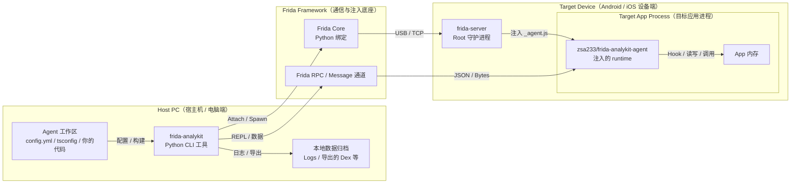

# Frida-Analykit

[](https://github.com/zsa233/frida-analykit/stargazers)
[](LICENSE)

🌍 Language: [中文](README.md) | English

`frida-analykit` v2 is a dual-artifact monorepo: the Python CLI handles environment setup, builds, injection, and data persistence, while the npm runtime `@zsa233/frida-analykit-agent` provides runtime capabilities for custom TypeScript Frida agents.

## Project Positioning

- The Python CLI handles the `frida-server` lifecycle, device connectivity, workspace generation, builds, attach/spawn flows, REPL, and exported artifacts.
- `frida-analykit-mcp` exposes the current Frida debugging flow as a stdio MCP server.
- `@zsa233/frida-analykit-agent` provides on-demand agent runtime capabilities such as helper, JNI, ELF, SSL, and Dex.
- The current support range is `frida>=16.5.9,<18`, and the currently tested versions are `16.5.9` and `17.8.2`; use `frida-analykit doctor` as the final decision point for your environment.

## Architecture Diagram



## Quickstart

1. Install the CLI. After this step you will have both `frida-analykit` and `frida-analykit-mcp`.

```sh
uv tool install "git+https://github.com/ZSA233/frida-analykit@stable"
```

2. Create and enter a matching Frida virtual environment. After this step you will have a fixed-version debugging context.

```sh
frida-analykit env create --frida-version 17.8.2 --name frida-17.8.2
frida-analykit env shell frida-17.8.2
```

3. Confirm that your Android device is visible from the host. After this step your target device should appear in the list.

```sh
adb devices
```

4. Generate an agent workspace and install dependencies. After this step you will have an editable `config.toml`, `index.ts`, `package.json`, `README.md`, and `README_EN.md`.

```sh
frida-analykit gen dev --work-dir ./my-agent
cd ./my-agent
npm install
```

5. Run the environment check first. After this step you will know whether the current Frida version, device, and remote `frida-server` are already usable.

```sh
frida-analykit doctor --config ./config.toml
```

6. If `doctor` still reports remote install or version findings, repair them and boot the remote chain. After this step the device side should be ready for injection.

```sh
frida-analykit doctor fix --config ./config.toml
frida-analykit server boot --config ./config.toml
```

7. Build, inject, and enter the REPL. After this step `_agent.js` will be built, a session will be attached, and you will see the banner in the terminal.

```sh
frida-analykit attach --config ./config.toml --build --repl
```

If the target app is not running yet, replace the last step with `frida-analykit spawn --config ./config.toml --build`.

## Minimal `config.toml` Example

The generated `config.toml` is already a good starting point. In most cases these are the first lines you need to edit:

```toml
app = "com.example.demo"                  # Target package name; used by attach / spawn
jsfile = "./_agent.js"                    # Built agent output from the current workspace

[server]
host = "usb"                              # Device transport: usb / local / host:port
path = "/data/local/tmp/frida-server"     # Device-side frida-server path

[agent]
datadir = "./data"                        # Host-side directory for logs, dumps, and exports
```

For deeper configuration details, go straight to [src/frida_analykit/resources/scaffold/README_EN.md](src/frida_analykit/resources/scaffold/README_EN.md). The generated workspace also includes the same README next to `config.toml`.

## More Capabilities

If you want to hand the current debugging flow to an MCP client / LLM, start this command:

```sh
frida-analykit-mcp --config ./mcp.toml
```

For the detailed MCP guide, see [src/frida_analykit/mcp/README.MD](src/frida_analykit/mcp/README.MD).

If you want to import helper, JNI, ELF, SSL, Dex, or other agent runtime capabilities on demand, go straight to [packages/frida-analykit-agent/README_EN.md](packages/frida-analykit-agent/README_EN.md).

## Device Tests And More Docs

When you need a device regression pass, the common entry points are:

```sh
make device-check
make device-test
make device-test-all
```

For prerequisites, failure classification, and rerun rules, see [docs/device-regression.md](docs/device-regression.md).

For the release process, see [docs/release-process.md](docs/release-process.md). For example projects, see [android-reverse-examples](https://github.com/ZSA233/android-reverse-examples).
