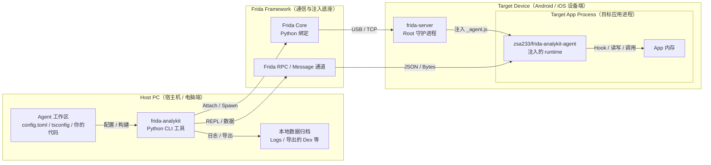

# Frida-Analykit

[](https://github.com/zsa233/frida-analykit/stargazers)
[](LICENSE)

🌍 Language: [中文](README.md) | English

`frida-analykit` v2 is a dual-artifact monorepo: the Python CLI orchestrates Frida environments, builds, injection, REPL, MCP, and data persistence, while the npm runtime `@zsa233/frida-analykit-agent` provides on-demand runtime capabilities for custom TypeScript Frida agents.

## Project Positioning

- `frida-analykit` is the main CLI for environment management, workspace generation, `frida-server` install/boot, attach/spawn, REPL, and device checks.
- `frida-analykit-mcp` is a stdio MCP server that can hand the Frida debugging flow to an MCP client or LLM tool flow.
- `@zsa233/frida-analykit-agent` is the agent runtime package for RPC, helper, process, JNI, ELF, SSL, Dex, and native binding capabilities.
- The current support range is `frida>=16.5.9,<18`; use `frida-analykit doctor` as the final compatibility check for your device and version.

## Quickstart

1. Install the CLI. This gives you `frida-analykit` and `frida-analykit-mcp`.

```sh
uv tool install "git+https://github.com/ZSA233/frida-analykit@stable"
```

2. Create and enter a virtual environment pinned to one Frida version.

```sh
frida-analykit env create --frida-version 17.8.2 --name frida-17.8.2
frida-analykit env shell frida-17.8.2
```

3. Confirm that your Android device is connected.

```sh
adb devices
```

4. Generate a TypeScript agent workspace and install dependencies.

```sh
frida-analykit gen dev --work-dir ./my-agent
cd ./my-agent
npm install
```

5. Edit `config.toml` using the generated workspace `README.md`, then run the environment check first.

```sh
frida-analykit doctor --config ./config.toml
```

6. If `doctor` reports remote `frida-server` install or version findings, repair them and boot the device-side server.

```sh
frida-analykit doctor fix --config ./config.toml
frida-analykit server boot --config ./config.toml
```

7. Build, inject, and enter the REPL.

```sh
frida-analykit attach --config ./config.toml --build --repl
```

If the target app is not running yet, use `frida-analykit spawn --config ./config.toml --build` instead of the last step.

## Documentation Index

| Topic | Documentation |
|:---|:---|
| Workspace config, `config.toml`, and common CLI use | [src/frida_analykit/resources/scaffold/README_EN.md](src/frida_analykit/resources/scaffold/README_EN.md) |
| MCP server, quick sessions, tools, and resources | [src/frida_analykit/mcp/README.MD](src/frida_analykit/mcp/README.MD) |
| Agent runtime import paths and capability table | [packages/frida-analykit-agent/README_EN.md](packages/frida-analykit-agent/README_EN.md) |
| ELF dump fixups fields and replay rules | [docs/elf-fixups.md](docs/elf-fixups.md) |
| Device regression, failure classification, and rerun rules | [docs/device-regression.md](docs/device-regression.md) |
| Release process and pre-publish checks | [docs/release-process.md](docs/release-process.md) |
| Example projects | [android-reverse-examples](https://github.com/ZSA233/android-reverse-examples) |

The minimal MCP startup entry is below. See the MCP documentation above for the full session flow and error recovery rules.

```sh
frida-analykit-mcp --config ./mcp.toml
```

## Architecture Diagram


```mermaid
flowchart LR
    subgraph Host["Host PC（宿主机 / 电脑端）"]
        direction TB
        WorkDir["Agent 工作区<br/>config.toml / tsconfig / 你的代码"]
        CLI["frida-analykit<br/>Python CLI 工具"]
        DataArchive["本地数据归档<br/>Logs / 导出的 Dex 等"]

        WorkDir -->|"配置 / 构建"| CLI
        CLI -->|"日志 / 导出"| DataArchive
    end

    subgraph Framework["Frida Framework（通信与注入底座）"]
        direction TB
        FridaCore["Frida Core<br/>Python 绑定"]
        RPCChannel["Frida RPC / Message 通道"]
    end

    subgraph Device["Target Device（Android / iOS 设备端）"]
        direction TB
        FridaServer["frida-server<br/>Root 守护进程"]

        subgraph App["Target App Process（目标应用进程）"]
            direction TB
            AgentRuntime["zsa233/frida-analykit-agent<br/>注入的 runtime"]
            TargetMem["App 内存"]

            AgentRuntime -->|"Hook / 读写 / 调用"| TargetMem
        end

        FridaServer -->|"注入 _agent.js"| AgentRuntime
    end

    CLI -->|"Attach / Spawn"| FridaCore
    CLI -->|"REPL / 数据"| RPCChannel
    FridaCore -->|"USB / TCP"| FridaServer
    RPCChannel -->|"JSON / Bytes"| AgentRuntime
```
